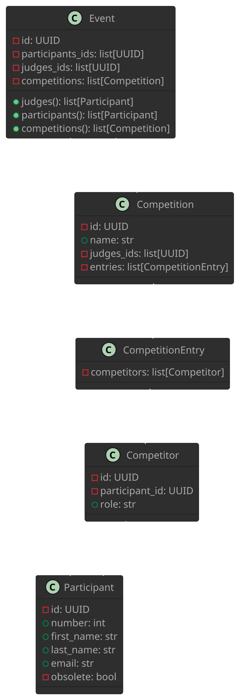
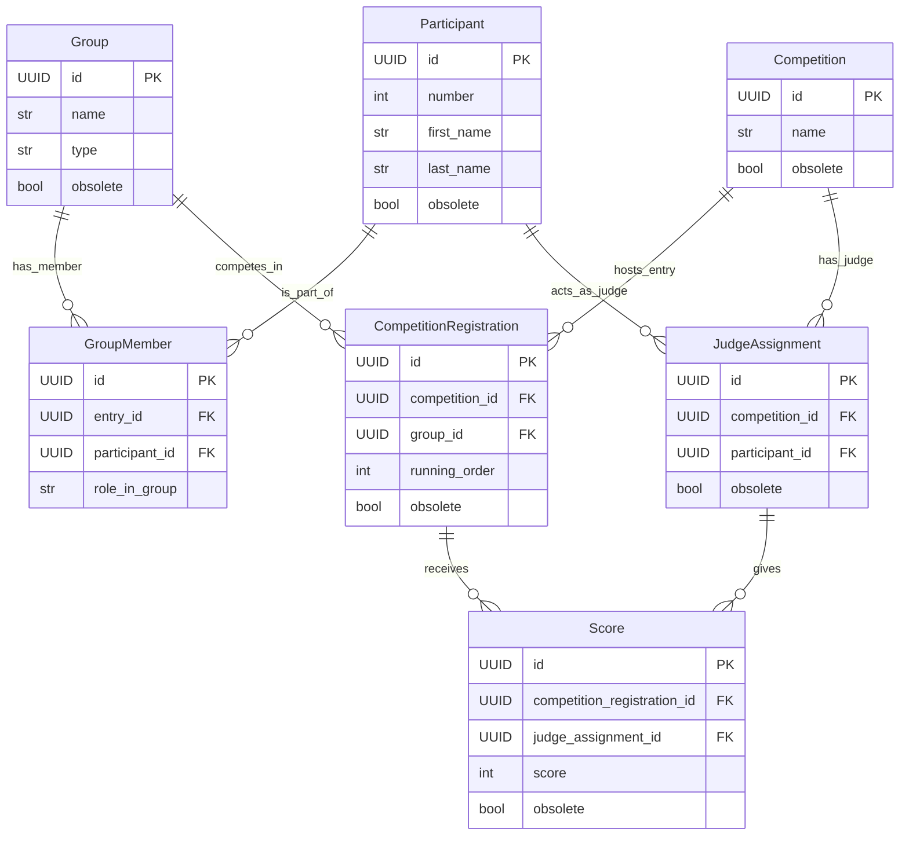

# Skating System App - Diagrams

## Classes

```plantuml
@startuml
  !theme reddress-darkgreen
  skinparam backgroundcolor transparent
  skinparam dpi 300

  class Event {
    -id: UUID
    -participants_ids: list[UUID]
    -judges_ids: list[UUID]
    -competitions: list[Competition]
    +judges(): list[Participant]
    +participants(): list[Participant]
    +competitions(): list[Competition]
  }

  class Participant {
    -id: UUID
    +number: int
    +first_name: str
    +last_name: str
    +email: str
    -obsolete: bool
  }

  class Competition {
    -id: UUID
    +name: str
    -judges_ids: list[UUID]
    -entries: list[CompetitionEntry]
  }

  class Competitor {
    -id: UUID
    -participant_id: UUID
    +role: str
  }

  class CompetitionEntry {
    -competitors: list[Competitor]

  }

  Event --> Participant
  Event --> Competition
  Competition --> CompetitionEntry
  CompetitionEntry --> Competitor
  Competitor --> Participant

@enduml
```

## ERD (for future use)

```mermaid
erDiagram
    Participant {
        UUID id PK
        int number
        str first_name
        str last_name
        bool obsolete
    }

    Group {
        UUID id PK
        str name
        str type
        bool obsolete
    }

    GroupMember {
        UUID id PK
        UUID entry_id FK
        UUID participant_id FK
        str role_in_group
    }

    Competition {
        UUID id PK
        str name
        bool obsolete
    }

    CompetitionRegistration {
        UUID id PK
        UUID competition_id FK
        UUID group_id FK
        int running_order
        bool obsolete
    }

    JudgeAssignment {
        UUID id PK
        UUID competition_id FK
        UUID participant_id FK 
        bool obsolete
    }

    Score {
        UUID id PK
        UUID competition_registration_id FK
        UUID judge_assignment_id FK
        int score
        bool obsolete
    }

    %% --- Relationships ---

    %% Participants & entries
    Participant ||--o{ GroupMember : is_part_of
    Group       ||--o{ GroupMember : has_member

    %% Entries & competitions
    Group       ||--o{ CompetitionRegistration : competes_in
    Competition ||--o{ CompetitionRegistration : hosts_entry

    %% Judges
    Participant ||--o{ JudgeAssignment : acts_as_judge
    Competition ||--o{ JudgeAssignment : has_judge

    %% Scoring
    CompetitionRegistration ||--o{ Score : receives
    JudgeAssignment        ||--o{ Score : gives
```
