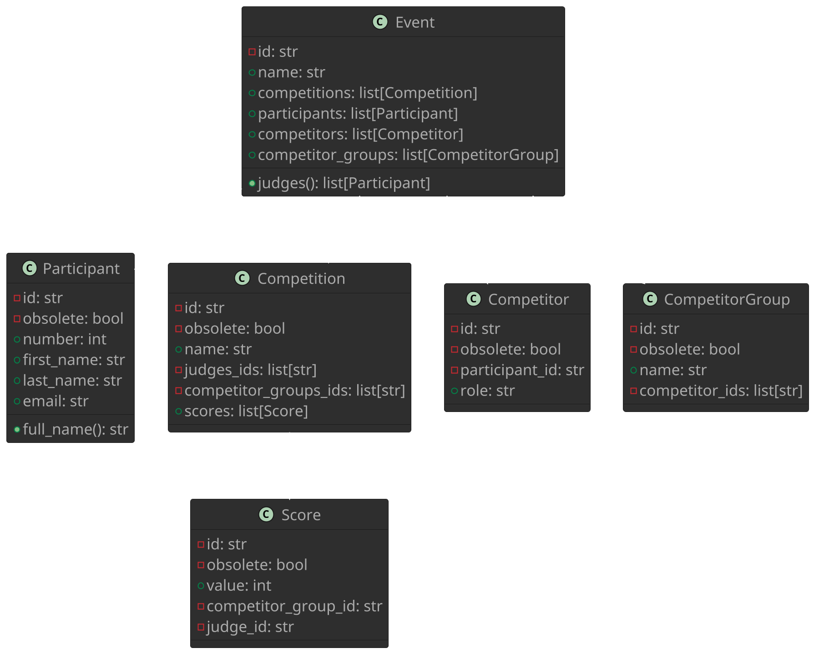

# Skating System App - Diagrams

## Skating System Classes

Why this structure?:

- to simplify first persistence scheme (aggregated json file)
- There is a lot of possible reusability for instance:
  - The same participant could be a competitor for a certain competition as a *leader* and in another competition as a *follower*.
  - The same competitor could be a lead in a duo (competitor group) and also a lead in a troup (another competitor group)
  - A competitor group like a troup could enter multiple competitions.
- The only really direct child-parent relation would be scores and competitions. Where scores do not really make sense outside a competition, but most certainly should not be reused.
